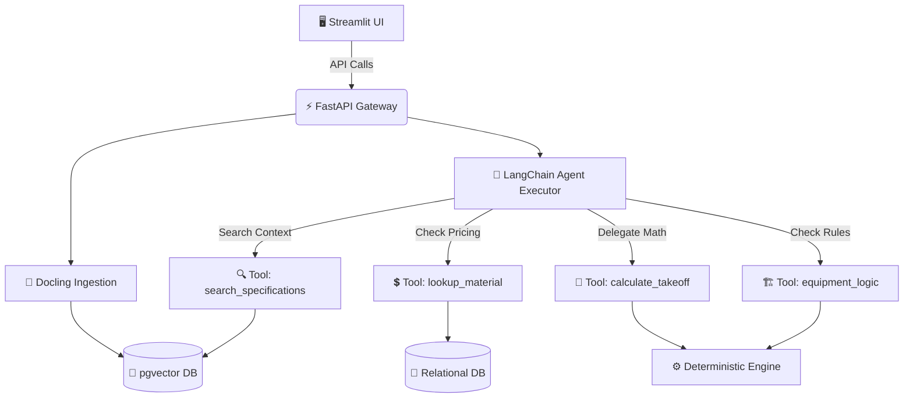

# 🏗️ AI Estimating Assistant (MVP)


> An enterprise-grade, human-in-the-loop AI estimating assistant designed for commercial construction and specialty subcontracting. 

## 🛡️ Core Philosophy: Zero Hallucination

Our architecture enforces a strict boundary to prevent LLM hallucinations:
1. **🤖 AI Reasoning (Probabilistic):** Uses Claude 3.5 Sonnet to read documents, classify scope, draft RFIs, and extract text. *It is allowed to be uncertain.*
2. **🧮 Calculation Engine (Deterministic):** Pure Python code handles all math (quantities, labor, material totals). **The AI NEVER calculates numbers.**

---

## 📐 System Architecture

The LLM acts as an Orchestrator/Router, utilizing specific tools for interactions rather than generating free-form responses.



---

## ✨ Features (Phase 1 MVP)

* **📄 Document Intake:** Automated pipeline using `Docling` to extract text and complex tables from PDF plans and specifications.
* **❓ RFI Generation:** Automatically identifies scope gaps and drafts Requests for Information (RFIs) with strict source citations.
* **⚡ Tool-Calling Agent:** Chat interface where the AI intelligently uses external tools to lookup internal pricing and verify logic.
* **✅ Human-in-the-loop:** Every takeoff line and RFI must be reviewed and approved by a human estimator.

---

## 🚀 Quick Start

### 1. Prerequisites
* Python `3.12+` and `uv` package manager.
* Docker Desktop (for PostgreSQL + pgvector).
* Anthropic API Key (`claude-3-5-sonnet`).

### 2. Setup Environment
```bash
# Clone and enter directory
cd AIEstimator

# Start Database
docker compose up -d

# Install dependencies using uv
uv venv
source .venv/bin/activate
uv pip install fastapi uvicorn streamlit langchain langchain-anthropic docling psycopg2-binary sqlalchemy pgvector pydantic-settings

# Configure environment variables
cp .env.example .env
# Edit .env and add your ANTHROPIC_API_KEY
```

### 3. Run the Services
**Start Backend (FastAPI):**
```bash
uvicorn backend.main:app --reload
```

**Start Frontend (Streamlit):**
```bash
streamlit run frontend/app.py
```

---

## 📂 Project Structure

```text
backend/
├── api/v1/                   # FastAPI Endpoints (Upload, Agent Chat)
├── core/                     # Configuration & Database setup
├── models/                   # SQLAlchemy Models (Postgres)
├── schemas/                  # Pydantic Models (Strict Structured Outputs)
└── services/                 # Business Logic
    ├── ingestion/            # Docling PDF Parser & Chunker
    ├── ai_reasoning/         # LangChain Agent & Tools (Probabilistic)
    └── calculation/          # Math Aggregator (Deterministic)
frontend/
└── app.py                    # Streamlit Human-in-the-loop UI
```
