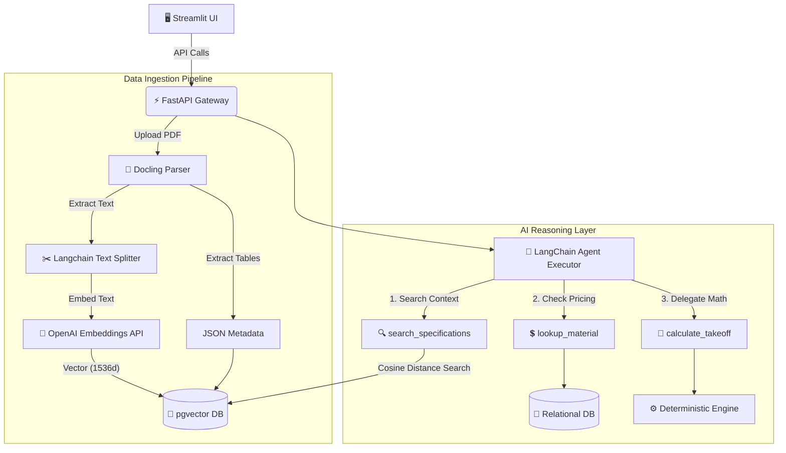

# 🏗️ AI Estimating Assistant (Enterprise Architecture)


> An enterprise-grade, human-in-the-loop AI estimating assistant designed for commercial construction and specialty subcontracting. Built to eliminate hallucination, scale across multiple projects, and automate tedious Takeoff workflows.

---

## 🛡️ Core Philosophy: Zero Hallucination

Our architecture enforces a strict boundary to prevent LLM hallucinations:
1. **🤖 AI Reasoning (Probabilistic):** Uses Claude 3.5 Sonnet to orchestrate workflows, classify scope, draft RFIs, and understand natural language. *It is allowed to be uncertain.*
2. **🧮 Calculation Engine (Deterministic):** Pure Python code handles all math (quantities, labor, material totals). **The AI NEVER calculates numbers.**
3. **🔍 Real RAG (Verifiable):** The AI cannot invent technical specifications. It must query the `pgvector` database to find exact semantic matches from uploaded blueprints and specs.

---

## 📐 System Architecture

The LLM acts as a `ReAct` Orchestrator, utilizing specific tools to fetch data from robust deterministic layers.



---

## ✨ Features (Current Phase)

* **📄 Advanced Document Intake:** Automated pipeline using `Docling` to extract text and deeply complex tables (Schedules) from PDF plans and specifications.
* **🔎 Real RAG Pipeline:** Documents are chunked and embedded via `OpenAIEmbeddings` into `pgvector`. The AI queries this vector store using Cosine Distance to guarantee highly accurate semantic retrieval.
* **📊 Schedule-Count Takeoff:** Extracted tabular data (e.g., Door Schedules, Hardware Sets) is instantly serialized and presented in the Streamlit UI for immediate human review.
* **⚡ Tool-Calling Agent:** Chat interface where the AI intelligently uses external tools to lookup internal pricing, verify rules, and fetch spec context. Multi-project context is strictly enforced.
* **✅ Human-in-the-loop:** Every takeoff line and RFI must be reviewed and approved by a human estimator.

---

## 🏗️ Design Patterns & Code Quality

* **Dependency Injection:** FastAPI `Depends` handles session management (`get_db`) and service lifecycles cleanly.
* **Repository Pattern:** Abstracted database interactions via `CRUDBase` and `CRUDDocument` for DRY and testable logic.
* **Centralized Logging:** Uniformly formatted logs injected at application startup to ensure trackability.
* **Modular DDD Structure:** Strict separation of concerns (API, Core, CRUD, Models, Schemas, Services).

---

## 🚀 Quick Start

### 1. Prerequisites
* Python `3.12+` and `uv` package manager.
* Docker Desktop (for PostgreSQL + pgvector).
* **Anthropic API Key** (for `claude-3-5-sonnet` agent reasoning).
* **OpenAI API Key** (for `text-embedding-3` RAG embeddings).

### 2. Setup Environment
```bash
# Clone and enter directory
git clone https://github.com/maver1ch/AIEstimator.git
cd AIEstimator

# Copy environment variables and fill in your API keys
cp .env.example .env
nano .env  # Add ANTHROPIC_API_KEY and OPENAI_API_KEY
```

### 3. Run the System
We provide a one-click startup script that initializes the Docker DB, sets up the virtual environment, installs dependencies, and launches both the FastAPI Backend and Streamlit Frontend.

```bash
chmod +x run.sh
./run.sh
```

**Access Points:**
- **Frontend (Streamlit):** `http://localhost:8501`
- **Backend (FastAPI Docs):** `http://localhost:8000/docs`

---

## 📂 Project Structure

```text
backend/
├── api/v1/                   # FastAPI Endpoints (Upload, Agent Chat)
├── core/                     # Config, DI, DB setup, Centralized Logging
├── crud/                     # Repository Pattern (CRUDBase)
├── models/                   # SQLAlchemy Models (Postgres & pgvector)
├── schemas/                  # Pydantic Models (Strict Structured Outputs)
└── services/                 # Business Logic
    ├── docling_parser.py     # Docling PDF Parser & Table Extractor
    ├── ai_reasoning/         # LangChain Agent, Prompts, & RAG Tools
    └── calculation/          # Math Aggregator (Deterministic)
frontend/
└── app.py                    # Streamlit Human-in-the-loop UI
```
